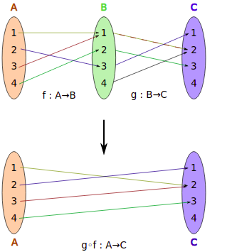
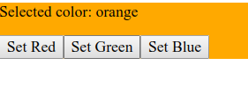
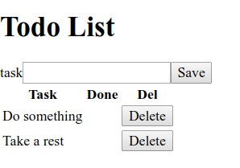

# Motivation
*Why should I care*


Language empires and kingdoms of frameworks rise and fall but only one thing remains: you have to maintain code. That is the part of software development process that takes most of the time and that is precisely why we all should care about creating good, clean, tested and easy-to-maintain code.

Functional Programming is one of those great topics like A.I., Internet, Sofware Engineering,... that come and go, and it is all the rage lately. But despite all the hype, any crafter should take this one because this provides tools that you may consider for your weaponry. Even if you don’t embrace it completely. After all, when Thorin Oakenshield (a proud dwarf king) got an elven sword he didn’t refuse to use it.

Take a look into some FP concepts and you’ll find valuable knowledge. And these are not like the latest-cool-frameworks or the new config format: these are coding technics that may help you on your daily work to write better code. These are topics that endure over time and that’s why it is worth dipping you toes on its waters.

No monads or functors, no abstract math, just simple code. This paper will try to introduce the basic building blocks of FP.

# So what is…?
## A program
As a developer, you should be good at abstractions, so consider this the ultimate abstraction: ¿what is a program? Or ¿What is a program made of? Essentially is just code and data. Code uses data to generate a result. 
It would be great if it was so easy but it’s not: a program has to deal with state changes. And that is the place where most of the bugs feast on our mistakes.

If that is not enough we also have side-effects everywhere: user interaction, logging, IO, etc. are a necessary evil.

How does FP help here? Let’s give a formal definition.

## Functional Programming
"...it’s a programming paradigm that treats computation as math functions” blah blah. Ok, anybody can google that. In a more down-to-earth definition, functional programming is a declarative way to write code, rather than imperative. Consider the classic example of the function that calculates the factorial of a number:

```JavaScript
factorial(0) = 1
factorial(n+1) = (n+1) * factorial(n)
```

It doesn’t say how to do the thing but what it does. That’s the difference: FP just **says what**, whereas declarative **explains how**.

Declarative style is growing in many languages and beyond simple and nice looks, it has great benefits. Here you have these well-known pieces of code:

```JavaScript
for (let i = 0; i< arr.length; i++) {
console.log(arr[i]);
}
```
And the declarative equivalent:
```JavaScript
arr.forEach(elem => console.log(elem));
```
In the classic for structure, we need to set 3 expressions to run the loop. The problem is not only that it’s rather verbose: there are, at least, 7 places where we could make a mistake in a classic for loop. On the other hand, a direct forEach on the array leaves less room for errors and looks cleaner.

FP also set constraints. Nobody likes the word constraint, but as you’ll see, it’s for your own good. We’ll discover those constraints in the next topics: immutability and pure functions.

# Immutability
Programs are about manipulating data, generally getting some data and transforming into something else. During that process, it’s necessary to keep the original data intact to get the desired results. Immutability is a constraint we should use to wear our applications.

The rule of thumb is simple, make a copy of the original data when you put your dirty fingers on it. Otherwise, bugs may show up with race conditions and unexpected behaviours of your program.

In JavaScript, the most common data structures are arrays and objects, and combinations of both. Let’s remind ourselves how to deal with these structures to add, extract, delete, update data from them. 

## Arrays
As well as LISP is about processing lists, we could say that JavaScript code is (quite often) about processing arrays. Thanks to the new spread `…` operator and deconstruction, now we are able to manipulate arrays in a very elegant way.

### Adding elements
We start with an array of wizards. We could add an element with push function, but this one mutates the original array. So we can just create a new array using the spread operator:

```JavaScript
const wizards = ["Gandalf", "Rincewind", "Merlin"];

// wizards.push("Raistlin"); ARGH NO!

const moarWizards = [...wizards, "Raistlin"];
// ["Gandalf", "Rincewind", "Merlin", "Raistlin"]

const evenMoarWizards = ["Radagast", ...moarWizards];
// ["Radagast", "Gandalf", "Rincewind", "Merlin", "Raistlin"]
```
We could also create a new array combining other arrays, elements and even empty elements:
```JavaScript
const others = [ "Haplo", "Alfred" ];
const assemble = [ ,,,"MyAss", ...wizards,, ...others ];
// [undefined, undefined, undefined, "MyAss", "Gandalf", "Rincewind", "Merlin", undefined, "Haplo", "Alfred"]
```

### Deleting/Extracting elements
How could we delete or extract values from an array? We shouldn’t delete values from the original array. But functions like slice and deconstruction can help to get certain parts of an array.

```JavaScript
const wizards = ["Gandalf", "Rincewind", "Merlin", "Haplo"];
// wizards.splice(-1);  ARGH NO!!
const allButLastWizard = wizards.slice(0, -1);
// ["Gandalf", "Rincewind", "Merlin"]
const lastWizard = wizards.slice(-1)[0] //.pop()? ARGH NO!
// "Haplo"
const [first, ...others] = wizards;   // shift?  ARG NO!
// "Gandalf" ["Rincewind", "Merlin", "Haplo"]
const [,second,,fourth] = wizards;
// [,"Rincewind",,"Haplo"]
```
We could also make use of filter function to extract a new array from another.

### Updating elements
If we just one to update certain elements of the array we can create a new one using `Object.assign`.
Obviously, a direct update on the array is mutable as well as functions like `fill` or `copyWithin` so **do not** use them.

```JavaScript
const wizards = ["Gandalf", "Rincewind", "Merlin", "Radagast"];
const changed = Object.assign([], wizards, {[2]: "Raistlin"});
// ["Gandalf", "Rincewind", "Raistlin", "Radagast"]
// copyWithin() or fill() ?? ARGH NO!
```

## Objects
As we said, when JavaScripts deals with lists of data it uses arrays. And most of the time those arrays contain objects. Both arrays and objects can be nested in many ways.

Do you also need to manipulate objects in a simple and immutable way? Spread operator and destructuring come to the rescue. Well, to be honest, they don’t guarantee immutability as we’ll see in the cloning section. But spread and destructuring will work well enough for simple flat objects.

### Adding elements
Let’s start with a fictional character with a couple of attributes, Spread operator allows us to add new attributes:
```JavaScript
const character = {
  name: "Dean Dan",
  race: "Orc"
};

const armedCharacter = {
  ...character,
  weapon: "Hammer"
};
/*
{
  name: "Dean Dan",
  race: "Orc",
  weapon: "Hammer"
}
 */
```
We can even add other objects:

```JavaScript
const weapon = {
  name: "SkullCrusher",
  damage: 10
};

const attributes = {
  str: 12, int: 16, dex: 10
};

const complete = {
  ...{...armedCharacter, weapon },
      attributes
};
/*
{
    attributes: {
    dex: 10,
        int: 16,
        str: 12
    },
    name: "Dean Dan",
        race: "Orc",
    weapon: {
      damage: 10,
      name: "SkullCrusher"
    }
}
*/
```
And we could also add attributes programatically, using variables for attribute names:

```JavaScript
const newAttribute = "class";
const awesome = {
  ...complete,
  [newAttribute]: "Paladin"
};
/*
{
  attributes: {
    dex: 10,
    int: 16,
    str: 12
  },
  class: "Paladin",
  name: "Dean Dan",
  race: "Orc",
  weapon: {
    damage: 10,
    name: "SkullCrusher"
  }
}
 */
```
### Deleting/Extracting elements
Deconstruction is, again, the tool of choice to delete/extract parts of an object.
```JavaScript
const character = {
  attributes: {
    dex: 10,
    int: 16,
    str: 12
  },
  name: "Dean Dan",
  race: "Orc",
  weapon: {
    damage: 10,
    name: "SkullCrusher"
  }
};

const { weapon, ...unarmed } = character;
/*
unarmed:
 {
  attributes: {
    dex: 10,
    int: 16,
    str: 12
  },
  name: "Dean Dan",
  race: "Orc"
}
 */
const { weapon, attributes, ...basic } = character;
/*
basic:
{
  name: "Dean Dan",
  race: "Orc"
}
 */
```
We could go further and extract an attribute inside a nested object:

```JavaScript
const {
  attributes : { int: intelligence },
  weapon: { damage }
} = character;
// intelligence: 16
// damage: 10
```
### Updating elements
Even if it looks a bit awful, Object.assign call will do it.
```JavaScript
const character = {
  attributes: {
    dex: 10,
    int: 16,
    str: 12
  },
  name: "Dean Dan",
  race: "Orc",
  weapon: {
    damage: 10,
    name: "SkullCrusher"
  }
};
const modified = Object.assign(character, {name: "Me"});
/*
{
  attributes: { ...},
  name: "Me",
  race: "Orc",
  weapon: { ... }
}
 */
```

We could also change an attribute in a nested object using deconstruction:

```JavaScript
const ordinaryBloke = {
  ...character,
    race: "white guy",
    name: "Joe",
    weapon: { ...character.weapon, name: "Open Palm" }
};
/*
ordinaryBloke:
{
  attributes: {...},
  name: "Joe",
  race: "white guy",
  weapon: {
    damage: 10,
    name: "Open Palm"
  }
}
 */
```

## Cloning stuff
Ok, now is when all things that we previously saw fall apart like a castle of cards. Well, it depends on how complex is the data structure: if we are dealing with objects that contain other nested objects and we don't clone them correctly, we probably could be mutating data. Be careful!

### Cloning objects
Just to raise awareness, consider the next character object:

```JavaScript
const character = {
    name: "Dean Dan",
    race: "Orc",
    weapon: {
        name: "SkullCrusher",
        damage: 10
    }
};
```
Now we can make a couple of copies in two different ways:

```JavaScript
const player1 = { ...character };
const player2 = Object.assign({}, character);
```
What happens if we change some data in those “cloned” objects?

```JavaScript
player1.name = "Pedro Gata";
player1.weapon.name = "Foehammer";
player2.name = "Juan Arkia";
player2.weapon.damage = 666;
/*
character:
{
  name: "Dean Dan",
  race: "Orc",
  weapon: [object Object] {
    damage: 666,
    name: "Foehammer"
  }
}
player1:
{
  name: "Pedro Gata",
  race: "Orc",
  weapon: [object Object] {
    damage: 666,
    name: "Foehammer"
  }
}
player2:
 {
  name: "Juan Arkia",
  race: "Orc",
  weapon: [object Object] {
    damage: 666,
    name: "Foehammer"
  }
}
 */
```

Ouch! the name attribute can be changed safely in each one, but when it comes to the nested weapon object if we change one of the copies we are changing all of them! This is because we are not really cloning, but making a **shallow copy**: it copies the first level of the object, for nested parts it copies a reference. That’s why we sometimes need to do deep cloning.
This well-known composition of stringify and parse will do the trick:

```JavaScript
const player3 = JSON.parse(JSON.stringify(character));

player3.weapon.name = "Anduril";
console.log(character, player1, player2, player3);
/*
character, player1, player2 are the same but:
player3:
{
  name: "Dean Dan",
  race: "Orc",
  weapon:  {
    damage: 666,
    name: "Anduril"
  }
}
 */
```

But again, it will not do it correctly for everything. Dates will not be cloned correctly and if there are functions you better forget about them in your cloned object.

## Cloning arrays

Same here, when we deal with arrays containing objects with nested objects inside. To expose the problem, we create an array of characters with cloned elements.

```JavaScript
const character = {
    name: "Dean Dan",
    race: "Orc",
    weapon: {
        name: "SkullCrusher",
        damage: 10
    }
};
const klone = obj => JSON.parse(JSON.stringify(obj));
const heroes = [klone(character), klone(character), klone(character)];
```

Now let’s change a nested object property the second element. What happens?

```JavaScript
heroes[1].weapon.name = "Sting";
/*
heroes:
[ {
    ...
  weapon: {
    damage: 10,
    name: "SkullCrusher"
  }
}, {
    ...
  weapon: {
    damage: 10,
    name: "Sting"
  }
}, {
    ...
  weapon: {
    damage: 10,
    name: "SkullCrusher"
  }
}]
 */
```

Ok, it changes the name of the second character’s weapon. What happens if we make a copy of the array (using any of the typical 5 different ways), and we change the same value?

```JavaScript
heroes2 = Array.from(heroes);
// [...heroes]
// heroes.slice()
// [].concat(heroes)
// Array.from(heroes)
// loops?
heroes2[1].weapon.name = "Orcrist";
```

If we check the original heroes array:

```JavaScript
/*
heroes change too because is a shallow clone!!!:
[ {
    ...
  weapon: {
    damage: 10,
    name: "SkullCrusher"
  }
}, {
    ...
  weapon: {
    damage: 10,
    name: "Orcrist"
  }
}, {
    ...
  weapon: {
    damage: 10,
    name: "SkullCrusher"
  }
}]
 */
```

Oh my god, it changes the original array.

So, to sum it up, be careful if you “clone” and change an array, you may have a fake clone and problems could arise.

And of course, beware of these mutating JavaScript functions: 

- pop
- push
- splice
- reverse
- shift
- unshift
- sort
- fill
- copyWithin.

# Pure functions
These are functions that for a given input they always return the same result, and they can’t have side effects. 
Obvious sample:

```JavaScript
function add (a, b) {
    return a + b;
}
```
We should try to make all our functions pure because:

- Easy to test.
- Easy to compose with others.
- Cacheable/Memoizable
- No side-effects.
- Lead to cleaner code.
 
**Easy to test**
Just an input and its output: you don't have to care about anything else.
Side effects make code more difficult to test and maintain. Why? Because to test something you probably need to define several mocks or prepare a lot of stuff.

**No side effects**
This is the key: a pure function can’t change or alter anything out of its boundaries. It can’t depend on anything from the outside. That means that:

- It can’t alter parameters, because it may alter the outside code execution.
- It can’t access data from the outside, because it may change during execution.
- It can’t log anything.
- It can’t listen to/emit events.
- ...

**Easy to compose with others**
As we will see later, pure functions enable composition, especially when functions have a single parameter.

**Cacheable/Memoizable**
When a function is pure it gives you the guarantee that it will always return the same thing for a given parameter. So, if we run the function once, we can save or store in a cache the result in case we call it again with the same parameter. There is no need to run it again, we know what the result will be. That’s also known as referential transparency because we could change the function call with a value.

**Parallelizable**
If functions don’t have any side effects, we can run them at the same time, right? So we get another good optimization.

So, purify your functions and try to write them in a pure way. These will become the basic units to use with FP in mind.

## ¿Pure or impure?
Let’s show some scenarios with some familiar code, and try to identify what is pure and what it’s not.

### Hello
An innocent function that shows a message on the console.
```JavaScript
function hello() {
  console.log("Hello log");
}
```
It’s impure. It’s affecting the outside world, even if it’s just a CLI.

### multiply
Here you have a couple of functions that multiply values and return the result:
```JavaScript
function multiply(a, b) {
  return a * b;
}

let c = 6;

function multiplyMe(a) {
  return (c = a * 2);
}
```
The first is perfectly pure. The second is altering a variable from the outside. Even if it’s a simple variable, the function multiplyMe is causing a side-effect and thus, it’s impure.

### say_hello
Another innocent function. This one just returns “Hello”, without using console.log. That may be clean enough.

```JavaScript
function sayHello() {
  return "Hello!";
}
```
Well, the problem with `sayHello` is that it doesn’t have any parameter and it always returns the same. Therefore, we may consider that `sayHello` is not even a function but a value.

### random
A classic code to generate a random number within a given range:
```JavaScript
function random(min, max) {
  return Math.round(Math.random() * (max - min)) + min;
}
```
Obviously, it’s impure. For the same parameters, it will return different results. This one is impure, but there are pure implementations of random number generators out there if you want to check.

### happy_birthday
This function receives an object and returns a copy of it.

```JavaScript
function happyBirthday(person) {
  return { ...person, age: person.age++ };
}
```
Well, it’s a modified copy. That unary operator is really dangerous and makes this function impure.

### push_me
A simple function to add an element into an array:
```JavaScript
function addElement(array, element) {
  return array.push(element);
}
```
push? Impure. There is no more to say.

### read
¿What about a function that makes some IO?
```JavaScript
function dataLength(filename) {
  const data = readFileSync(filename);
  return data.length;
}
```
Burn the heretic! IO depends on the outside and any function that deals with it will have the *taint of chaos*. Impure. 
There are ways to create functors to deal with IO in a pure way though. But not like that. 

### trigonometry
Hey, this is just Math stuff, this should be ok.
```JavaScript
function sinusoidal(a) {
  return Math.sin(a) * 5;
}
```
Nope. When we deal with these kinds of numbers with a lot of decimals, the result may be different depending on where this code runs. It’s impure.

### promises
This stupid pseudocode shows just a promise. Maybe it’s not the best example.
```JavaScript
function doAsyncStuff(a, b) {
  return new Promise(a + b);
}
```
Well, apparently it will always return the same for a and b. The problem with promises in general and in the JavaScript world is that they may depend on the event loop. And who knows what is the state of it. Does it depend on the outside? Bad thing.

### date_diff
Sometimes we need to deal with dates… so?
```JavaScript
function dayInterval(date) {
  const today = new Date();
  return today - date;
}
```
`Date()` call will always be problematic. `new Date()` will return the current date and that will depend on the outside. The machine clock may not be set correctly. So it leads to unexpected behaviour. We could improve it adding today as a parameter.

# Function composition
Composition is a combination of two or more functions to create a new function.
In a nutshell, it’s a function that takes another function as an argument and/or returns a function. The next figure shows how composition looks like from a mathematical perspective.



You’ve probably done this somewhere in a casual way, but for Functional Programmers, THIS is the way. 
A simple example to create a function that calculates a prize and also rounds the result we could do something like:

```JavaScript
Math.round(calculate(prize));
```
We can create a new function with a composition of both like this:

```JavaScript
const compose = (f, g) => prize => f(g(prize));
const total = compose(Math.round, calculate);
```
And now we can use it that function directly:
```JavaScript
total(prize);  //= Math.round(calculate(prize));
```

Let’s explore some scenarios where we create a function composing other functions. Composition can be done by hand but we’ll use the Ramda library to build compositions easier. It’s better if you can try these scenarios as an exercise in https://codesandbox.io/s/fpjscomposition-d99rx

## Example: positive integer
We have a couple of simple functions: one of them returns the absolute value of a number, and the other converts a string to an integer. For simplicity shake, there is no type check or whatsoever.
```JavaScript
import R from "ramda";

function toPositive(number) {
  return Math.abs(number);
}

function toInteger(whatever) {
  return +whatever;
}
```
How do we create a function that given a string returns a positive integer? 
Easy, combining previous functions. Please note that composition works from right to left, so first, it will call `toInteger` and then it will call `toPositive`.
```JavaScript
const positiveInteger = R.compose(
    toPositive,
    toInteger
);
```
Now we can call that function:
```JavaScript
positiveInteger("-88"); // 88
```

## Example: format string
In this scenario, we have three different functions that deal with strings:

- `toLowerCase` converts a given string to lowercase.
- `firstToUpper` returns a string with the first character in uppercase.
- `RemoveQuotes` removes quotes from a string.

```JavaScript
import R from "ramda";

function toLowercase(words) {
  return words.toLowerCase();
}

function firstToUpper(words) {
  return words.charAt(0).toUpperCase() + words.slice(1);
}

function removeQuotes(words) {
  return words.replace(/"/g, "");
}
```

We want a function that given a malformed string returns something readable, without quotes and a correct case. We can compose previouse functions in a new one:
Solution:
```JavaScript
const format = R.compose(firstToUpper, toLowercase, removeQuotes);
```
Now we can call that function:
```JavaScript
format("hE\"LlO\""); // "Hello"
```

## Example: logger
Now let’s imagine that we have to develop a function to create nice log messages, with a prefix, with a date and a custom suffix. But we just have three separate functions that give us just one piece of the desired result:
```JavaScript
import R from "ramda";

function addPrefix(msg) {
  return "Log> " + msg;
}

function addDate(msg) {
  return new Date().toUTCString() + " " + msg;
}

function addSuffix(msg) {
  return msg + ".";
}
```
Well, if we want a function that generates a nice log message, we’ll reuse those functions:
Solution:
```JavaScript
const logger = R.compose(addPrefix, addDate, addSuffix);
```
Now we can call that function:
```JavaScript
logger("it works"); // "Log> 2020-01-10 12:44:33 it works."
```
## Example: params_list
Sometimes we need to extract some data from a string, and we can apply split to function to reach some part of it. If we don’t use regex, we could compose other functions to create a function to extract that data.
We start with three simple functions, one to decode URLs, another to get the query string of a URL and the last to get the parameters.

```JavaScript
import R from "ramda";

function decode(uri) {
  return decodeURI(uri);
}

function getQuery(uri) {
  return uri.split("?")[1];
}

function getParams(query) {
  return query.split("&").map(a => a.split("=")[0]);
}
```
How could we make a function that returns an array with all the param names of the query string of a url? You guessed it: we combine them.
Solution:
```JavaScript
const paramsList = R.compose(getParams, getQuery, decode);
```

We can use it now:
```JavaScript
paramsList("http://88.com/?id=42&name=me"); // ["id", "name"]
```

## Pipe instead of compose
An alternate way to achieve composition is to use `pipe` instead of `compose`. It has the same effect but when we use `pipe` me have to reverse the order of the functions we want to compose:

```JavaScript
const paramsList = R.pipe(decode, getQuery, getParams);
```
It may look easier to understand for some, after all, according to Cheto’s dilemma of Clean Code, cleanliness may be an arbitrary quality of the code.

But keep in mind:
write your functions in a way that they can be combined. This is the way.

# Currying
Currying takes a function with n parameters and turns it into n functions with a single parameter. 


It may sound crazy at first, but it’s just another technique for code reuse.

Currying it’s a basic tool to create new code, just as we do with composition, and it also allows us to create nice expressions to map over data.
As a simple example, we have a function that calculates a final prize given the prize, discount and taxes:
```JavaScript
const total = (tax, discount, amount) => { … }
```
We can create a curried version turning that into three functions just like this:
```JavaScript
const totalCurried = tax => discount => amount => { … }
```
And now we can create a couple of functions just calling the curried version:
```JavaScript
onst totalNormalTax = totalCurried(21)(10);
const totalReducedTax = totalCurried(16)(10);

totalNormalTax(600); // applies 21% and 10%
```
As we did in the composition topic, let’s see some scenarios. Once again, it would be better if you try these as exercise on this online scenario:
https://codesandbox.io/s/fpjscurrying-97hte

## Example: increment
This is the simplest example possible. We have a classic function that adds two values. 
```JavaScript
import R from "ramda";

function add(a, b) {
  return a + b;
}
```
Now we would like to create a new function that just increments a value. 
Solution:
```JavaScript
const curriedAdd = R.curry(add);
const increment = curriedAdd(1);
```
And now we can call it:
```JavaScript
increment(87); // 88
```

## Example: words
Another nice and easy example of how currying creates new functions. We have a general function that splits a string with another string. 

```JavaScript
import R from "ramda";

function split(separator, message) {
  return message.split(separator);
}
```
We want a function called `words` that returns an array of words from a phrase. How could we do it? Easy-peasy with a curried version of `split`:
Solution:
```JavaScript
const curriedSplit = R.curry(split);
const words = curriedSplit(" ");
```
And this is how we could use it:
```JavaScript
words("Don't come easy"); // ["Don't", "come", "easy"]
```

## Example: discount10Percent

This is similar to the first example. We have a function that given the percentage, calculates a discount on a prize.
```JavaScript
import R from "ramda";

function discount(percent, prize) {
  return prize * (percent / 100);
}
```
How could we create a function that simply calculates a discount of 10% for any given prize. Currying the `discount` function:
```JavaScript
const curriedDiscount = R.curry(discount);
const discount10Percent = curriedDiscount(10);
```
Now we can call it directly:
```JavaScript
discount10Percent(20); // 2
```

## Example: html elements

Imagine that we are tired of generating HTML with strings, so we decide to write a function to do it for us. Given an element/tag and a content, it returns a HTML node.
```JavaScript
import R from "ramda";

function html(element, content) {
  return `<${element}>${content}</${element}>`;
}
```
We could use that function directly to generate HTML stuff.
```JavaScript
html("div", "Div content");
html("p", "this is a paragraph");
html("div", html("span", "Hello"));
```
But calling `html` all the time with two parameters looks a bit confusing. It would be nice to have a function for each tag type. Our code would looks easier to read.

If we create a curried version of the `html` funtion,
```JavaScript
const curriedHTML = R.curry(html);
const p = curriedHTML("p");
const div = curriedHTML("div");
const span = curriedHTML("span");
```
Now the code looks much better with meaningfull functions:
```JavaScript
div("Div content");
p("this is a paragraph");
div(span("Hello"));
```
## Example: html elements variant hand-made currying

How could we make a curried version of a function if Ramda or other helper libraries are not available?
If we have a similar function to the previous one:
```JavaScript
function html(tag, lowercase, content) {
  return `<${tag}>${lowercase ? content.toLowerCase() : content}</${tag}>`;
}
```
We could create a curried version just like this:
```JavaScript
function curriedHTML(tag) {
  return function(lowercase) {
    return function(content) {
      return `<${tag}>${lowercase ? content.toLowerCase() : content}</${tag}>`;
    };
  };
}

const div = curriedHTML("div")(false);
```

So… 

immutability, pure functions, composition, and currying. They are useful concepts on their own. But when we combine them together we can build great things. And for functional programming, these are the building blocks that we will use.

# Sample Applications
Ok, you may be thinking that this FP thingy could have some theoretical value but not a **real** use in the **real** world. With a couple of sample applications, you may see some of the FP principles in action. Both of them are similar, web apps that do some specific task, and both of them try to use pure functions as much as possible and isolate state changes.

The first one is extremely simple and stupid but it's a good starting point to show the basic structure of the app. The second app does more things but the underlying structure is the same.

You can download these apps from this repository where you can also find all code samples and scenarios used in this document: https://github.com/pxai/fjs

To create the views the apps use Hyperscript library with a helper. This makes the HTML generation really simple. Optionally you can apply Tachyons library for styling.

## Colour changer
This application has the following web interface:



Awesome, right? Thanks to this cutting-edge piece of technology I’m so loaded that every morning I dive in a pool of cocaine. But let’s focus and explain what it does. It’s simple: if offers you a screen with a default background colour (orange). When you click on the buttons you can change that background colour.

¿How can we achieve this in a functional way? As we said before, we will try to use just pure functions, immutable data and isolate model changes.

### Initial Model

We have to think about the model, a data structure that will contain the whole state of the app. In this case, there is just one piece of data: the current colour. Therefore, the model, in this case, will be just a string containing the name of the colour, and its initial value will be “orange”.

### View

The view will contain functions to generate the user interface. This will make use of Hyperscript, and it will create a piece of HTML using model data. It’s a pure function that receives some parameters and will return the view using those parameters.

```JavaScript
import hh from "hyperscript-helpers";
import { h }from "virtual-dom";
const { div, p, button } = hh(h);

function view (change, model) {
    return div({style: `background-color: ${model}`}, [
            p(`Selected color: ${model}`),
            div([
                button({onclick: () => change("red")}, 'Set Red'),
                button({onclick: () => change("green")}, 'Set Green'),
                button({onclick: () => change("blue")}, 'Set Blue')
            ])
        ]
    );
}
```
Maybe you noticed those pesky change calls, and you may think this function is not pure at all because is doing something outside. But it’s not the case. If you look carefully, you’ll realize that it doesn’t really call that `change` function. This function will just return an HTML with some buttons that will fire an event if you click on them.

The view function doesn’t know what is the purpose of `change`, but it’s easy to explain: `change` call will fire an update of the state. That will be managed in the main function of the end.

### Update

This `update` function is a pure function that given a model and a value, it will return a new model.  If the value we pass is included in the allowed colours, that value will be returned. If not, the original model will be 
returned.

```JavaScript
function update (value, model) {
    if (["red","green","blue"].includes(value)) {
        return value;
    }
    return model;
}
```

Don’t let the name `update` confuse you. If you observe again, the function is pure. It doesn’t change any state from the outside. It just returns values depending on the parameters, and that returned value will be used as a new model.

That model will be used somewhere else to update the state of the app. This project executes that change in a single place, isolating state management from the rest of the app.

### Init

And this is that place: here is where we wire up the view and the model. A single function that loads the view with the initial model and the `update` function, adds it to an HTML document and most importantly: it defines the `change` function.

The `change` function inside init is responsible for the updates on the state. This is precisely the function that is passed to the view to create buttons that will call it. 

```JavaScript
import { diff, patch } from "virtual-dom";
import createElement from "virtual-dom/create-element";
import { view, update } from "./app";

function init(initModel, update, view, node) {
    let model = initModel;
    let currentView = view(change, model);
    let rootNode = createElement(currentView);
    node.appendChild(rootNode);
    function change (value) {
        model = update(value, model);
        const updatedView = view(change, model);
        const changes = diff(currentView, updatedView);
        rootNode = patch(rootNode, changes);
        currentView = updatedView;
    }
}
```
Whenever the user clicks the button, the `change` function will do the following:

- It will call the `update` pure function and generate a new model. Here is were we change the state of the app:
`model = update(value, model);`
- That model will be passed to the view function to create a new view.
- Using the `diff` function we’ll detect changes in the DOM of the HTML document.
- Using virtualDOM, we update the HTML document through the `patch` function.

Every time that the user interacts with the app, this `change` function will be called and this process will be repeated. Maybe it sounds familiar? Sure, this is what **React** does!

Next, this is how we start the app: we choose an element of the DOM and we use it to init the app with an initial model (“orange”). We also provide the `update` and the `view` pure functions.


```JavaScript
const rootNode = document.getElementById("app");
init("orange", update, view, rootNode);
```

### HTML
The HTML is pretty simple in this case. We just need an element with an id called `app`.
```html
<!DOCTYPE html>
<html>
<head>
    <title>
        App1
    </title>
    <link rel="stylesheet"  href="css/style.css" type="text/css" />
</head>
<body>
    <div id="app"></div>
    <script type="text/javascript" src="js/bundle.js"></script>
</body>
</html>
```

## Yet another Todo list
Yeah I know, a Todo list. How original. But the previous project made me a millionaire so I don’t really care. The truth is that we just need an example of a project that manages a list of data.



But hey, if you are tired by now, we have good news for you: this project follows the same principles of the other. The differences are, obviously, that the state will be more complex and there will be more ways to change it. No worries, we will keep those changes at bay.

### Initial Model

The model must be able to contain and reflect the state of the program at any time. Well, in an interpreted language like JavaScript it’s easy to grow any data structure but we should think carefully about how the model should look like.

In this particular case, we need a model that holds an array of tasks. Each task just has a couple of attributes: `name` and `done`. There is something else in the model that may not look so obvious at first sight: `name` and `done` attributes. Whaaaat?

Well, this model must be able to reflect the state of the program, isn’t it? So those attributes will contain the data introduced in the forms whenever we want to add new data.

```JavaScript
const initModel = {
    tasks: [
        { name: "Do something", done: false },
        { name: "Take a rest", done: false }
    ],
    name: '',
    done: false
};

export default initModel;
```
In this app, the view will show the value of the model at the bottom. This will come in handy to confirm how the state evolves:

### View
Here we go again with the view. This will be a piece of cake, but in this case, we will need to split the view into more functions because the user interface takes much more work. The names of the functions should be clear enough to understand.

As we said in the description of this project, there will be more places where we will try to change the state: when we add a task, when we delete one and when we edit the form. We will notify those changes using the `change` function used before, but in this case, we will append a message that will allow us to pass parameters and most importantly, to specify what kind of operation we want to perform.

So, again, this view functions will be purely pure and immaculate. But obviously, there will be attributes for certain events that will trigger state changes.

```JavaScript
import hh from "hyperscript-helpers";
import { h }from "virtual-dom";
import { deleteMsg, inputMsg, addMsg } from "./update";

const {
    div, h1, button, pre,
    form, label, input,
    table, th, tr, td, a
 } = hh(h);

function view (change, model) {
    return div( [
            h1("Todo List"),
            taskForm(change, model),
            div([
                taskTable(change, model)
            ]),
            div([pre(JSON.stringify(model, false, 2))])
        ]
    );
}

function taskForm(change, model) {
    return form([
        label("task"),
        input({
            type: 'text',
            value: model.task,
            oninput: e => change(inputMsg(e.target.value))
          }),
        button({
            type: 'button',
            onclick: () => change(addMsg())
        }, "Save")
    ]);
}

function taskTable(change, model) {
    return table([
        tr([
            th("Task"), th("Done"), th("Del"),
        ]),
        model.tasks.map(taskRow(change))
    ])
}
function taskRow(change) {
    return function (task, index) {
        return tr([
            td(task.name),
            td(task.done ? "Done":""),
            td([
                button({onclick: () => change(deleteMsg(index))} , "Delete")
            ])
        ]);
    }
}
export default view;
```

### Update
The update gets bigger but you don't have to worry, because we will keep all functions clean. 

First of all, we create a simple hash-like structure to contain all possible messages. This is convenient because the message type will be referenced in three places, at least:

```JavaScript
export const MSG = {
  ADD: "add",
  DEL: "delete",
  INPUT: "input"
};
```
Then, for each message type, we create a function that receives a parameter and creates a message. This function will be called by the view and a message will be returned from it. Each message contains a type (used in `update` function to decide what to do) and in some cases some extra info that can be used in the update process.

```JavaScript
export function deleteMsg(index) {
    return {
        type: MSG.DEL,
        index
    }
}
export function inputMsg(text) {
    return {
        type: MSG.INPUT,
        text
    }
}
export function addMsg() {
    return {
        type: MSG.ADD
    }
}
```
And finally, the `update` function. We need to do it bigger than the previous project because it must take care of each message type. It also receives the model with the current state.

Inside the update, depending on the message type we create a new model based in the original. That model will be used somewhere else where the state is changed in an isolated place:

```JavaScript
export function update(msg, model) {
    switch (msg.type) {
        case MSG.DEL:
            return {
                ...model,
                tasks: model.tasks.filter((task, i) => i !== msg.index)
            };
        case MSG.INPUT:
            return { ...model, name: msg.text }
        case MSG.ADD:
            const task = { name: model.name, done: false };
            return {
                ...model,
                tasks: [...model.tasks, task]
            };
        default:
            return model;
    }
}
export default update;
```
Even if it shows that ugly switch/case structure, the `update` function is still perfectly pure and easy to test. There are alternate ways to write that and avoid the switch/case don’t worry. We could also extract the code from each case too. The point here is that `update` returns a new model for each message or it just returns the model as it was.

Does this `update` sound familiar? This is, in essence, what **Redux** does. Redux can be used in React applications to isolate state management from components. With Redux, a React component (that looks slightly like our views here), binds state values with a centralized **store** and events are dispatched like messages to the update function. In short, it separates the state from the components.

When the state structure gets too complex, there are tools to normalize the state: these tools transform a nested state into flat objects, making the state easier to manage.

Who will change the state? 

### App

Surprise it’s me, the app! And what? Yes, it’s exactly the same code from the simple project. State changes continue isolated here in this simple file. In the meantime, we see that we were able to create a much more complex app with
the same piece of code to take care of the state changes. Brilliant.

```JavaScript
import { diff, patch } from "virtual-dom";
import createElement from "virtual-dom/create-element";
import initModel from "./model";
import view from "./view";
import update from "./update";

function init(initModel, update, view, node) {
    let model = initModel;
    let currentView = view(change, model);
    let rootNode = createElement(currentView);
    node.appendChild(rootNode);
    function change (value) {
        model = update(value, model);
        const updatedView = view(change, model);
        const changes = diff(currentView, updatedView);
        rootNode = patch(rootNode, changes);
        currentView = updatedView;
    }
}

const rootNode = document.getElementById("app");
init(initModel, update, view, rootNode);
```

# References
There are tons of resources, I'll name just a few. The first book is supposed to be a masterpiece of programming in general. The second is easier and focused on JavaScript.

## Some books
- Structure and Interpretation of Computer Programs, Gerald Jay Sussman & Hal Abelson
- Functional light JavaScript, Kyle Simpson
- Functional Programming in JavaScript, Luis Atencio

## Links
- [Functional JavaScript at Medium](https://medium.com/javascript-scene/tagged/functional-programming)
- [Functional at freecodecamp](https://www.freecodecamp.org/learn/javascript-algorithms-and-data-structures/functional-programming/)
- [Ramda library](https://ramdajs.com/)
- [Lodash fp module](https://github.com/lodash/lodash/wiki/FP-Guide)
- [Interesting blog about FO and other stuff](https://blog.ploeh.dk/archive/)
- [does it mutate site](https://doesitmutate.xyz/)
- [Hyperscript](https://github.com/hyperhype/hyperscript)
- [Tachyons](https://tachyons.io/)